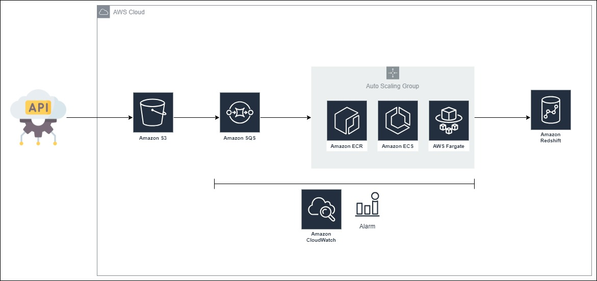

# Coffee Shop Sales Data Pipeline

## Index

- [About](#about)
- [How to Run the Project](#run)
<br>

## About <a name = "about"></a>

Data Flow:

<br>

<br>

## How to Run the Project <a name = "run"></a>

### Requirements
- <a href="https://aws.amazon.com/pt/free/?trk=16c88e2f-f4a2-4df9-a8da-5cec9a840180&sc_channel=ps&ef_id=Cj0KCQjwy9-kBhCHARIsAHpBjHgoBuCsAGz5KbOD-mBqkU-pjhss27HIyogO5NptoI4K8hKOtHVkpkMaAms4EALw_wcB:G:s&s_kwcid=AL!4422!3!659757281492!e!!g!!conta%20da%20aws!20187397673!152493143234&all-free-tier.sort-by=item.additionalFields.SortRank&all-free-tier.sort-order=asc&awsf.Free%20Tier%20Types=*all&awsf.Free%20Tier%20Categories=*all">AWS Account & AWS CLI</a>
- <a href="https://developer.hashicorp.com/terraform/downloads?product_intent=terraform">Terraform</a>
- <a href="https://www.docker.com/">Docker</a>

```
make TERRAFORM_BUCKET_NAME=change \
PROJECT_BUCKET_NAME=change \
REDSHIFT_PASSWORD=change
```