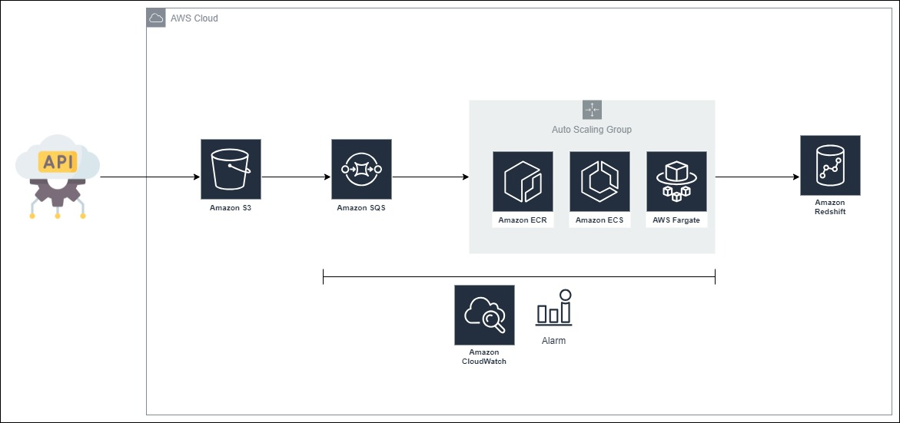

# Fluxo de Dados Para Cafeteria

## Índice

- [Sobre](#about)
- [Como rodar o projeto](#run)
<br>

## Sobre <a name = "about"></a>


Foi lhe foi atribuído a tarefa de elaborar uma prova de conceito (PoC) para construir um fluxo de dados relacionado
às numerosas cafeteiras da empresa X. Após reuniões com os stakeholders foi definido o seguinte fluxo para os dados:

<br>

<br>

Como a empresa já utilizava AWS como provedor de serviços em nuvem, foi decidido a incorporação de outros serviços ao 
Amazon Redshift para melhorar a operação e manutenção do fluxo de dados.

## Como Rodar o Projeto <a name = "run"></a>

### Requisitos
- <a href="https://aws.amazon.com/pt/free/?trk=16c88e2f-f4a2-4df9-a8da-5cec9a840180&sc_channel=ps&ef_id=Cj0KCQjwy9-kBhCHARIsAHpBjHgoBuCsAGz5KbOD-mBqkU-pjhss27HIyogO5NptoI4K8hKOtHVkpkMaAms4EALw_wcB:G:s&s_kwcid=AL!4422!3!659757281492!e!!g!!conta%20da%20aws!20187397673!152493143234&all-free-tier.sort-by=item.additionalFields.SortRank&all-free-tier.sort-order=asc&awsf.Free%20Tier%20Types=*all&awsf.Free%20Tier%20Categories=*all">Conta AWS & AWS CLI</a>
- <a href="https://developer.hashicorp.com/terraform/downloads?product_intent=terraform">Terraform</a>
- <a href="https://www.docker.com/">Docker</a>

Execute o comando abaixo em um terminal Linux na pasta raiz do projeto, antes disso, altere os campos <b>TERRAFORM_BUCKET_NAME</b>, <b>PROJECT_BUCKET_NAME</b> e <b>REDSHIFT_PASSWORD</b>.


```
make TERRAFORM_BUCKET_NAME=change \
PROJECT_BUCKET_NAME=change \
REDSHIFT_PASSWORD=change
```